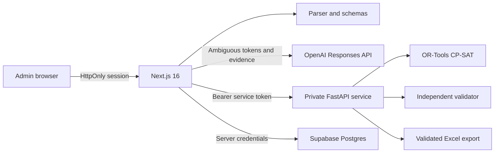

# NurseFlow AI

Admin-only, privacy-aware nurse scheduling decision support built for OpenAI
Build Week. NurseFlow turns a pseudonymous nurse request sheet into validated
ICU roster candidates, explains trade-offs, records the selected version, and
exports a review-ready workbook. The supplied MICU form is supported, but its
employee-code and notes columns are discarded during import.

> **Project status:** public hackathon prototype. The source is open, but the
> admin workspace is not anonymously accessible, and solver work endpoints
> require private ingress. NurseFlow is not a clinical system and must not
> autonomously make staffing decisions.

## Contents

- [Why NurseFlow](#why-nurseflow)
- [Workflow and capabilities](#workflow-and-capabilities)
- [Architecture](#architecture)
- [Built with Codex and OpenAI](#built-with-codex-and-openai)
- [Quick start](#quick-start)
- [Configuration](#configuration)
- [Data and import contract](#data-and-import-contract)
- [Scheduling and validation](#scheduling-and-validation)
- [API surface](#api-surface)
- [Supabase persistence](#supabase-persistence)
- [Testing and quality](#testing-and-quality)
- [Deployment](#deployment)
- [Security and data-use warning](#security-and-data-use-warning)
- [Project structure](#project-structure)
- [Documentation](#documentation)
- [Contributing](#contributing)
- [License](#license)

## Why NurseFlow

Nurse rosters combine daily coverage, skill mix, leave, education, individual
requests, previous-month sequences, and fairness goals. The work is repetitive
and difficult to audit, but the final decision still needs an experienced human.
NurseFlow separates the parts of that workflow by responsibility:

- deterministic parsing handles known request notation;
- GPT-5.6 suggests interpretations only for ambiguous tokens and explains
  structured solver evidence;
- Google OR-Tools CP-SAT creates complete candidate rosters;
- an independent validator recomputes every hard rule;
- an administrator compares candidates and confirms the final decision.

The language model does **not** build the roster, relax hard constraints, or
confirm a schedule.

## Workflow and capabilities

```text
Sign in as administrator
  -> import Google Sheet or .xlsx
  -> normalize request values
  -> review every ambiguous value
  -> generate three CP-SAT candidates
  -> independently validate each candidate
  -> compare requests, balance, and L0 usage
  -> inspect assignment-level evidence
  -> confirm one valid version
  -> persist immutable history when Supabase is configured
  -> export a validated Excel workbook
```

Key capabilities include:

- a responsive five-step workspace for import, review, generation, comparison,
  and confirmation;
- a built-in synthetic August 2026 MICU dataset with 28 unique nicknames and no
  patient data;
- `.xlsx` upload and import from a Google Sheets export, bounded to 10 MB;
- explicit human review for low-confidence or non-standard request notation;
- three optimization profiles: request-first, balanced, and reduced Member L0
  utilization;
- assignment evidence, unfulfilled-request explanations, validation results,
  daily coverage, and workload metrics;
- immutable Supabase confirmation history and archive export when persistence is
  configured;
- a deterministic local fallback when OpenAI or Supabase is intentionally absent.

## Architecture



| Component | Responsibility | Trust boundary |
| --- | --- | --- |
| Next.js | UI, admin session, imports, orchestration, OpenAI calls, persistence | Only browser-facing application service |
| FastAPI | Deterministic demo input, optimization, validation, workbook export | Internal service; work endpoints require a bearer token |
| OpenAI | Structured suggestions and evidence-grounded explanations | Receives bounded, nickname-level context; `store: false` |
| Supabase | Period inputs, candidate versions, validation evidence, confirmation history | Grants and RLS constrain browser access; the privileged server key remains server-only |
| Browser | Human review, candidate comparison, explicit confirmation | Never receives server secrets or calls the solver directly |

Failure is explicit. Missing OpenAI configuration uses deterministic suggestions;
missing Supabase configuration displays confirmation only in the current browser
workspace; solver failures return a service error instead of a fabricated result.

## Built with Codex and OpenAI

GPT-5.6 is called through the OpenAI Responses API with Structured Outputs for
two bounded runtime tasks: ambiguous-token suggestions and explanations derived
from solver facts. Both have deterministic fallbacks. CP-SAT remains the only
roster generator, and the validator remains independent of the model.

Codex supported architecture exploration, implementation across TypeScript and
Python, admin authentication, security hardening, test generation, browser QA,
documentation, and release preparation. It was used to challenge and verify
system boundaries, not as a substitute for deterministic validation or human
approval.

## Quick start

### Prerequisites

- Node.js `>=20.9.0`
- Python `>=3.11` (the solver container uses Python 3.12)
- [uv](https://docs.astral.sh/uv/) for Python environments
- OpenSSL or another secure random generator for local secrets

### 1. Install dependencies

```bash
git clone https://github.com/SuphakornP/nurseflow-ai-scheduler.git
cd nurseflow-ai-scheduler
npm ci
uv sync --directory services/solver --extra dev
```

### 2. Create local configuration

```bash
cp .env.example .env.local
cp services/solver/.env.example services/solver/.env.local
openssl rand -base64 48
openssl rand -base64 48
```

Use the first random value for `AUTH_SECRET`. Use the second value as
`SOLVER_API_TOKEN` in **both** `.env.local` files. Do not reuse one value for
both purposes. Use a password manager to create a separate administrator
password of at least 12 characters, then add the email, password, and display
name to the root `.env.local`.

Minimal root template (fill every blank before starting the application):

```dotenv
ADMIN_EMAIL=admin@example.local
ADMIN_PASSWORD=
ADMIN_DISPLAY_NAME=Build Week Scheduler
AUTH_SECRET=
SOLVER_API_URL=http://127.0.0.1:8000
SOLVER_API_TOKEN=
```

### 3. Start both services

```bash
npm run dev:all
```

Open [http://localhost:3000](http://localhost:3000), then sign in with the
administrator account from `.env.local`. The solver listens on
`http://127.0.0.1:8000`; its public health response can be checked with:

```bash
curl http://127.0.0.1:8000/health
```

Run one service at a time with `npm run dev` or `npm run dev:solver`.

## Configuration

### Next.js environment

| Variable | Required | Scope | Purpose |
| --- | --- | --- | --- |
| `ADMIN_EMAIL` | Yes | Server | Email for the only permitted administrator |
| `ADMIN_PASSWORD` | Yes | Server | Event-only plaintext deployment secret; minimum 12 characters |
| `ADMIN_DISPLAY_NAME` | Yes | Server | Header identity and non-email audit actor; maximum 80 characters |
| `AUTH_SECRET` | Yes | Server | Signs eight-hour admin sessions; independent random value, minimum 32 characters |
| `SOLVER_API_URL` | For live generation | Server | Private solver base URL; defaults to `http://127.0.0.1:8000` |
| `SOLVER_API_TOKEN` | For live generation | Server | Bearer token shared only with FastAPI; minimum 32 characters |
| `OPENAI_API_KEY` | No | Server | Enables AI normalization suggestions and explanations |
| `OPENAI_MODEL` | No | Server | OpenAI model; defaults to `gpt-5.6-terra` |
| `NEXT_PUBLIC_SUPABASE_URL` | For persistence | Browser-visible | Supabase project URL |
| `NEXT_PUBLIC_SUPABASE_PUBLISHABLE_KEY` | No (reserved) | Browser-visible | Reserved browser-client helper; no current UI path consumes it |
| `SUPABASE_SECRET_KEY` | For persistence | Server | Trusted candidate persistence and confirmation RPC access |
| `NEXT_PUBLIC_DEMO_MODE` | No | Browser-visible | Reserved showcase setting; currently does not bypass auth or change runtime behavior |

### Solver environment

`services/solver/.env.local` contains only `SOLVER_API_TOKEN`. It must exactly
match the root value. The solver compares bearer tokens in constant time.

| Optional integration | Behavior when absent |
| --- | --- |
| OpenAI | Known values remain deterministic; ambiguous values still require human review; reason-code explanations remain available |
| Supabase | Confirmation is displayed in the current browser workspace, marked `LOCAL_DEMO`, and lost on refresh |
| Solver | The UI can show its precomputed synthetic snapshot, but live generation and service-backed Excel export are unavailable |

Admin authentication is always required. Configuration failures close access
rather than creating a public demo mode.

## Data and import contract

The importer accepts either the normalized template or the supplied MICU
request-form layout. The first worksheet must include:

- `nickname` or `ชื่อเล่น`;
- `skill_level` or `level`;
- every date from the configured context range (three columns in the built-in
  August 2026 period);
- one date column for each day in the scheduling period.

For the MICU request form, the exact header combination `รหัสพนักงาน`,
`ชื่อ - สกุล`, and `Level` is also supported. Column B is treated as the
single-token display nickname. Employee codes and the trailing `หมายเหตุ`
column are accepted but deliberately omitted from the normalized dataset,
solver payload, and export. The leading `29`, `30`, and `31` columns map to
July context dates; the following `1` through `31` columns map to August.
`Member L.1`, `Member L.2`, and `Member L.0` are accepted skill labels.

Supported request notation:

| Input | Meaning |
| --- | --- |
| empty | Available for Day, Night, or OFF |
| `O1` ... `O4` | Ranked OFF request |
| `O/D`, `D/O` | OFF or Day |
| `O/N`, `N/O` | OFF or Night |
| `VAC` | Locked vacation |
| `ED` | Locked education |
| `D`, `N`, or an unknown token | Ambiguous until a human accepts the mapping |

Imports with explicit first-name, last-name, or full-name headers are rejected,
except for the exact MICU compatibility layout above; its display values must
still be unique single-token nicknames or pseudonyms.
Google Sheet URLs must use the expected
`https://docs.google.com/spreadsheets/d/...` form and be accessible to anyone
with the link. That ingestion path is suitable only for synthetic or otherwise
approved non-sensitive data.

## Scheduling and validation

FastAPI accepts at most 100 nurses, a 62-day period, and 6,200 requests or
previous assignments. Pydantic rejects unknown fields and bounds identifiers,
strings, staffing ranges, rule windows, time limits, and export assignments.

The three candidate profiles use the same hard constraints but prioritize soft
goals differently:

| Profile | Primary intent |
| --- | --- |
| `requests_first` | Maximize ranked request satisfaction before balance goals |
| `balanced` | Balance request satisfaction, workloads, weekends, and skill usage |
| `minimize_l0` | Reduce Member L0 clinical assignments while preserving feasibility |

Hard validation covers assignment completeness, daily Day/Night coverage,
skill mix, locked events, sequence limits, previous-month boundaries, and
configured Member L0 limits. Candidate metrics cover request satisfaction,
Day/Night distribution, weekend balance, Member L0 usage, and hard-rule pass
counts. Invalid candidates cannot be confirmed or exported.

See [solver assumptions](services/solver/ASSUMPTIONS.md) for the explicit
business-rule interpretations used by the prototype.

## API surface

### Next.js Route Handlers

Every protected page and non-auth application Route Handler validates the admin
session independently of `proxy.ts`. State-changing routes also require a
same-origin request.

| Endpoint | Method | Purpose |
| --- | --- | --- |
| `/api/auth/login` | `POST` | Validate the single admin and create the session cookie |
| `/api/auth/logout` | `POST` | Delete the session and redirect to `/login` |
| `/api/health` | `GET` | Authenticated readiness for solver, OpenAI mode, and persistence mode |
| `/api/import` | `POST` | Parse a bounded `.xlsx` upload or Google Sheet export |
| `/api/normalize` | `POST` | Suggest mappings for reviewed ambiguous tokens |
| `/api/demo` | `POST` | Load and solve the synthetic showcase dataset |
| `/api/generate` | `POST` | Generate all three candidate profiles from a validated dataset |
| `/api/explain` | `POST` | Explain an outcome from structured facts |
| `/api/confirm` | `POST` | Recheck and confirm a cached valid candidate |
| `/api/history` | `GET` | Read confirmed Supabase history for a period |
| `/api/export` | `POST` | Export a current or persisted validated version |

### FastAPI service

| Endpoint | Access | Purpose |
| --- | --- | --- |
| `GET /health` | Public, minimal | Returns only `{"status":"ok"}` |
| `GET /demo` | Bearer token | Returns deterministic synthetic solver input |
| `POST /generate` | Bearer token | Runs CP-SAT and independent validation |
| `POST /export` | Bearer token | Revalidates assignments and returns `.xlsx` |

FastAPI intentionally has no CORS middleware and disables `/docs`, `/redoc`, and
`/openapi.json`. Browsers must call Next.js, never FastAPI directly.

## Supabase persistence

The migration in `supabase/migrations/` defines 18 nickname-only application
tables, explicit grants, forced Row Level Security, audit fields, immutable
confirmed versions, and bounded server-only RPCs. The synthetic seed creates the
MICU department, rule configuration, 28 nurses, August 2026 period, prior
context, and normalized requests.

Local Supabase development:

```bash
npx supabase@latest start
npx supabase@latest db reset
npx supabase@latest db lint --local
```

Apply the migration to a dedicated remote project only after review:

```bash
npx supabase@latest link --project-ref YOUR_PROJECT_REF
npx supabase@latest db push
```

The live dataset must match staged period employees before confirmation. The
repository does not automatically apply migrations to a remote project or
create Storage buckets. Import/export buckets must be private and accessed only
through signed or server-side operations.

Read [the database guide](docs/database.md) before using a shared project.

## Testing and quality

| Command | What it verifies |
| --- | --- |
| `npm run lint` | ESLint and Next.js TypeScript rules |
| `npm run typecheck` | Strict TypeScript with no emitted files |
| `npm run test:web` | Vitest unit and route-boundary tests |
| `npm run test:solver` | Pytest model, solver, validator, auth, and export tests |
| `npm test` | Web and solver suites sequentially |
| `npm run build` | Production Next.js standalone build |
| `npm audit --audit-level=low` | npm dependency advisories |
| `uv run --directory services/solver --extra dev --with pip-audit pip-audit` | Python dependency advisories |

The current baseline contains 117 Vitest cases and 58 pytest tests. Coverage
focuses on authentication, route protection, request limits, schema boundaries,
import privacy checks, normalization, all three optimization profiles,
cross-month validation, error sanitization, and spreadsheet formula safety.
Browser QA is currently manual; no automated end-to-end browser suite is
checked in.

The pull-request workflow runs lint, type checking, both test suites, and the
production build with live OpenAI and Supabase credentials explicitly absent.
These checks use local mocks and OR-Tools only, so review runs do not consume
OpenAI or Supabase API credits. Normal GitHub Actions runner usage still applies.

## Deployment

The web application builds with Next.js `output: "standalone"`. The solver has a
runtime-only Docker image:

```bash
docker build -t nurseflow-solver services/solver
docker run --env-file services/solver/.env.local \
  -p 127.0.0.1:8000:8000 nurseflow-solver
```

For a hosted deployment:

1. Serve Next.js over HTTPS so the production session cookie is `Secure`.
2. Keep FastAPI on private ingress and set `SOLVER_API_URL` to that internal URL.
3. Store all server secrets in the platform secret manager, never build args or
   browser environment variables.
4. Set the same solver token on both services and keep it distinct from
   `AUTH_SECRET`.
5. Add edge request-size limits, shared rate limits, logs, monitoring, and
   appropriate service timeouts.
6. Use a dedicated Supabase project with reviewed migration, RLS, grants, and
   private Storage.

## Security and data-use warning

This public repository contains synthetic showcase data only. Do not commit,
upload, or paste into issues, pull requests, screenshots, demo videos, CI logs,
or public judge instructions any real staff/patient data or any value from
`.env.local`. Treat nicknames as pseudonymous personal data in real deployments.

Never expose `OPENAI_API_KEY`, `SUPABASE_SECRET_KEY`, `ADMIN_PASSWORD`,
`AUTH_SECRET`, or `SOLVER_API_TOKEN`. Variables beginning with `NEXT_PUBLIC_`
are browser-visible by design. A Supabase publishable key is not a server secret,
but it is safe only when grants and RLS have been reviewed.

Admin access uses a signed, host-only, `HttpOnly`, `SameSite=Strict` cookie with
an absolute eight-hour lifetime; production adds `Secure`. Verification checks
signature, issuer, audience, expiry, `ADMIN` role, and configured email. Login
failures are limited to five per 15 minutes **per Next.js process**. Rotating
`AUTH_SECRET` invalidates all active sessions.

There is no signup, external-user role, password reset, remember-me, or
client-side token storage. The event UI does not use Supabase Auth; database
roles in the migration are reserved for a future managed-auth deployment.

OpenAI normalization receives an ambiguous token plus a pseudonymous request
identifier containing the nurse ID and date. Explanation calls include nickname,
date, request, assignment, reason code, and solver facts. Setting `store: false`
reduces platform retention but does not make nickname-level data anonymous.

The event-only plaintext administrator password, process-local rate limiting,
and lack of MFA are not suitable for a hospital pilot. Use managed identity,
password hashing, MFA, centralized revocation and abuse controls, an approved
private ingestion path, and organizational privacy/security governance first.
See the [security review](security_best_practices_report.md) and
[privacy policy](docs/privacy.md) for accepted hackathon risks.

## Project structure

```text
app/                     Next.js pages and server Route Handlers
  api/                   Authenticated application APIs and auth endpoints
  login/                 Admin access checkpoint
components/              Login, workspace, schedule matrix, and demo UI
lib/                     Contracts, auth, import, OpenAI, solver, export, Supabase
  auth/                  Config, credentials, JWT sessions, proxy helpers, tests
  supabase/              Browser/admin clients and candidate persistence
services/solver/
  app/                   FastAPI, CP-SAT, validator, normalization, export
  tests/                 Pytest model, API, optimization, and boundary tests
  ASSUMPTIONS.md          Scheduling rule decisions
supabase/
  migrations/            Versioned Postgres schema
  seed.sql                Synthetic MICU showcase data
docs/                     Architecture, database, privacy, and submission notes
.github/workflows/ci.yml  Credit-safe pull-request verification
proxy.ts                  Next.js page/API authentication filter
security_best_practices_report.md
AGENTS.md                 Contributor and coding conventions
```

## Documentation

| Document | Contents |
| --- | --- |
| [Architecture](docs/architecture.md) | Runtime boundaries, auth flow, failure behavior, and deployment shape |
| [Database](docs/database.md) | Schema, RLS, grants, persistence RPCs, immutability, and seed data |
| [Privacy](docs/privacy.md) | Inbound data, OpenAI disclosure, storage, administrator identity, and production follow-up |
| [Solver service](services/solver/README.md) | FastAPI setup and endpoint contract |
| [Solver assumptions](services/solver/ASSUMPTIONS.md) | Business-rule interpretations and known boundaries |
| [Security review](security_best_practices_report.md) | Verified controls, residual risks, dependency audits, and release decision |
| [Contributor guide](AGENTS.md) | Repository layout, style, tests, commits, and security configuration |
| [Devpost worksheet](docs/devpost-submission.md) | Submission copy, video plan, judging alignment, and remaining checklist |
| [Demo runbook](docs/devpost-demo-runbook.md) | Privacy-safe capture plan, voiceover, media list, and credit controls |

## Contributing

Read [AGENTS.md](AGENTS.md) before making changes. Keep commits scoped and use a
short imperative subject. Add focused tests for behavior changes, run
`npm run lint`, `npm run typecheck`, `npm test`, and `npm run build`, and include
screenshots for UI changes.

Fixtures and examples must remain synthetic and pseudonymous. Never include a
secret, personal data, or vulnerability details in a public issue. Use the
repository's private vulnerability-reporting form when available; otherwise,
open a detail-free issue asking the maintainer to arrange a private channel.

## License

Unless otherwise noted, repository-authored source code and documentation are
licensed under the [MIT License](LICENSE). Third-party dependencies remain
subject to their own licenses. This license does not certify the software for
clinical use.
