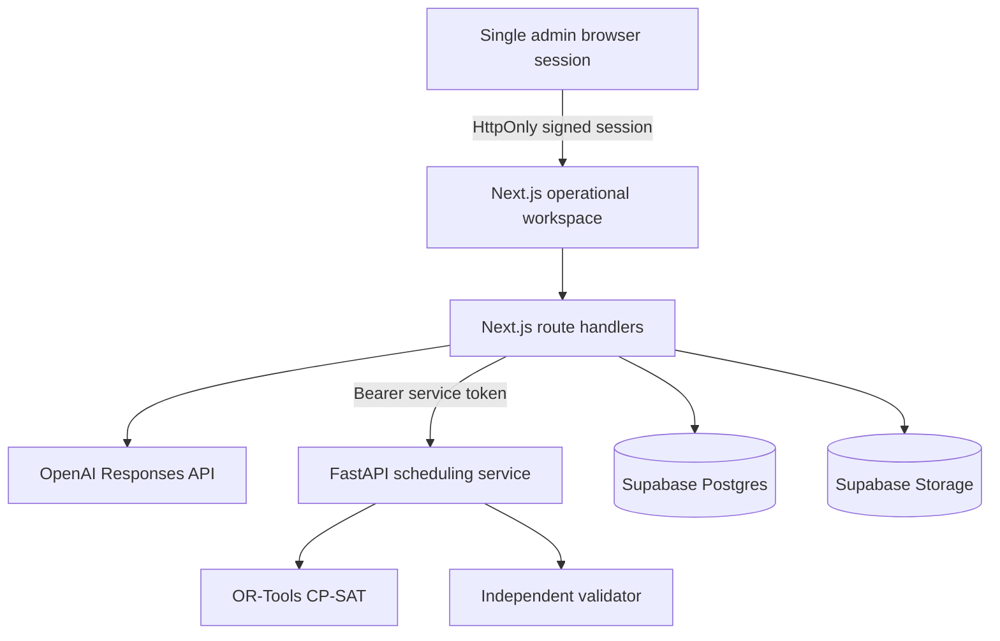

# Architecture

## Product boundary

NurseFlow separates probabilistic language work from deterministic scheduling work:

- The parser handles casing, whitespace, aliases, and known request syntax before AI is called.
- Each import creates a hash-bound, privacy-sanitized first-sheet template. Export
  preserves its cell styling but cannot reuse a newer template for an older
  generated version.
- The importer classifies approved Vacation and non-L0 Education as fixed `LOCKED` events, and O/D or O/N as `REQUIRED` choice sets.
- Member L0 Education, OFF priorities, Day, Night, and blank availability remain `PREFERENCE`; only these soft inputs may yield to hard constraints.
- GPT-5.6 Terra sees only ambiguous tokens or structured reason facts, never full source rows.
- CP-SAT is the only component allowed to create a complete roster.
- The validator re-computes every hard rule from assignments and previous-month context.
- The administrator compares three optimization profiles, with mandatory evidence separated from unmet soft requests, before choosing a version.
- Confirmation and export require `VALID` status plus a nonempty, entirely passing hard-validation set. Confirmation is executed atomically in Postgres when persistence is configured.

## Runtime components

The browser never calls the solver directly. FastAPI does not enable CORS; Next.js attaches the shared bearer token when calling `/demo`, `/generate`, and `/export`. The public `/health` route returns only minimal status.

## Authentication boundary

- `proxy.ts` redirects anonymous page requests to `/login`, returns `401` for anonymous API requests, and sends an authenticated administrator away from `/login` to the workspace.
- Route Handlers verify the signed session independently of the proxy. They check the JWT signature, issuer, audience, expiry, `ADMIN` role, and configured administrator email.
- State-changing requests must pass a same-origin check. Login attempts are limited to five per 15 minutes in each Next.js process.
- The absolute session lifetime is eight hours. Rotating `AUTH_SECRET` invalidates all existing sessions, and sign out deletes the host-only cookie.

## Failure behavior

- Missing OpenAI key: deterministic suggestions and reason-code explanations; human review remains required.
- Missing Supabase credentials: local showcase session only, clearly labeled as not persisted.
- Solver input rejected: FastAPI returns `422`; Next.js preserves `422`, adds a
  server-generated `x-request-id`, and logs only the profile, aggregate counts,
  safe validation categories, and allowlisted field paths.
- Solver unavailable: transport, authentication, and upstream service failures
  return a client-safe `503` without exposing service configuration.
- Missing or invalid admin configuration: login fails closed with `503`; anonymous pages redirect to `/login` and anonymous APIs return `401`.
- Missing or invalid solver token: work endpoints fail closed; the solver health check remains minimal and public for service orchestration.
- Infeasible datasets or missing/malformed hard-validation evidence: no synthetic success response; confirmation and export remain blocked. Deterministic fixed-event capacity conflicts are returned as date/skill evidence so Admin can add relief or correct the approved source before re-importing.
- OpenAI failure with a configured key: API returns `502`; it does not silently present a generated explanation as an AI result.

## Deployment shape

- Deploy `app/` on a Node-compatible Next.js host.
- Deploy `services/solver/` as a long-running Python service with at least one CPU and a request timeout above the solver limit.
- Set `SOLVER_API_URL` to the private service endpoint.
- Set a matching random `SOLVER_API_TOKEN` on Next.js and the solver; do not expose the solver work endpoints directly to browsers.
- Browsers call only Next.js; the solver intentionally does not enable CORS. Its `/health` endpoint exposes only minimal service status, while `/demo`, `/generate`, and `/export` require the bearer service token.
- Set the single event administrator and `AUTH_SECRET` only in the Next.js secret store. Rotate the signing secret to revoke all sessions.
- Use a dedicated Supabase project or branch for the event.
- Keep OpenAI and Supabase secret keys in the server-side deployment secret store.
